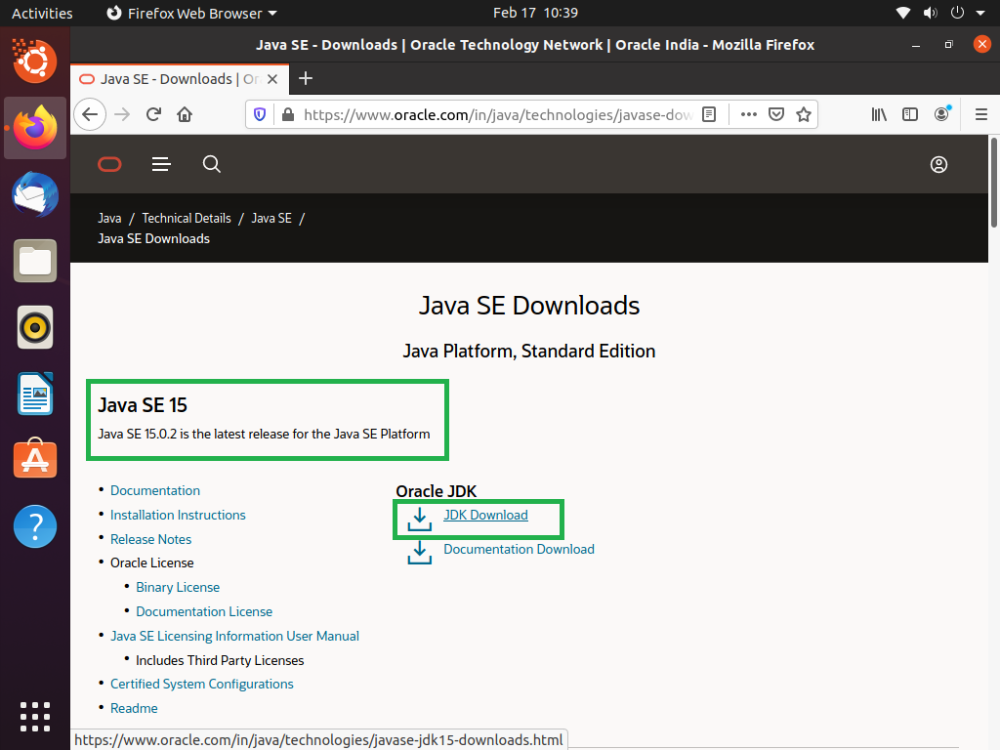
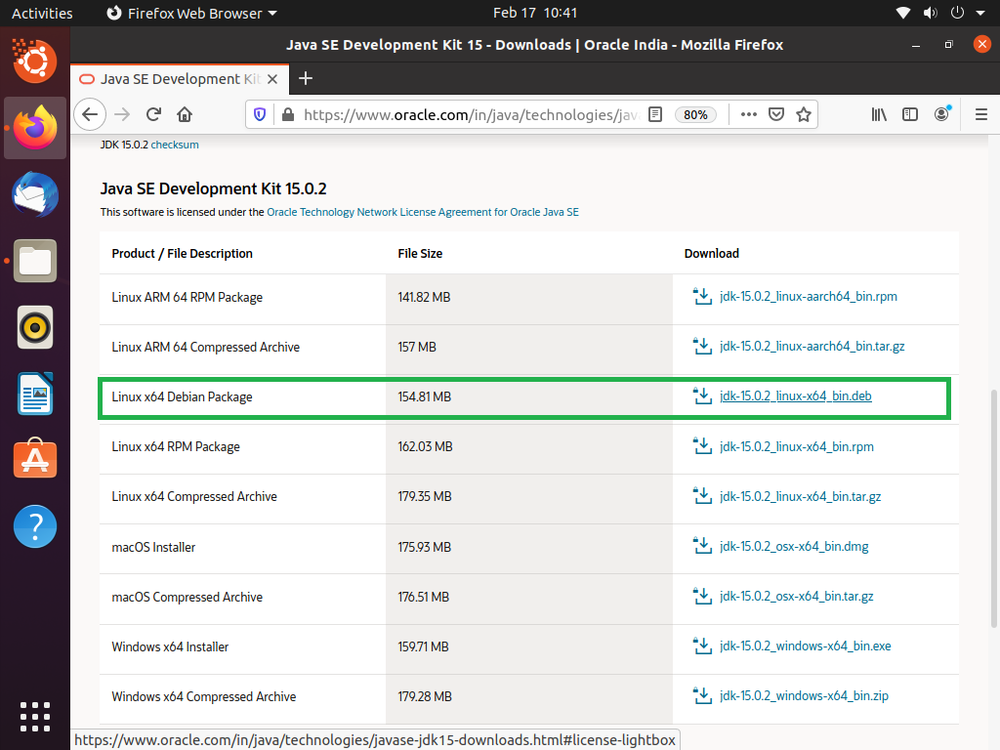
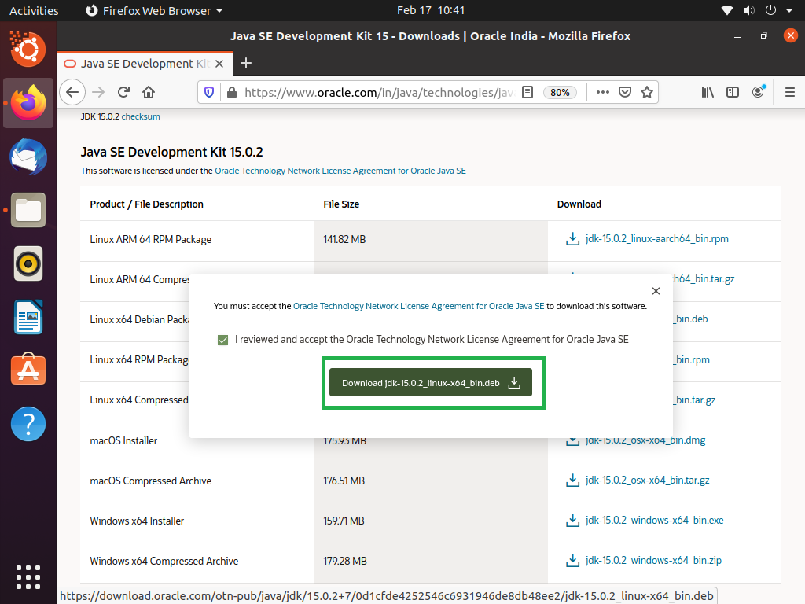
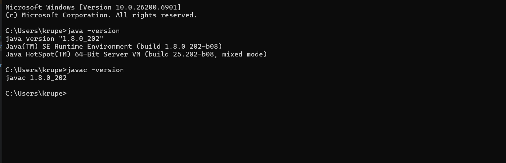

# MediTrack – Java Environment Setup Instructions

## 1. Prerequisites
- Operating System: Windows
- Internet connection
- Basic command-line knowledge

---

## 2. Install Java Development Kit (JDK)

### Step 1: Download JDK
Download JDK 8 or above from:
- https://www.oracle.com/java/technologies/downloads/


> MediTrack is built using Core Java and requires JDK 8+.

> 

> 

> 
> ---

### Step 2: Install JDK
Follow the installer steps based on your OS.

## 3. Verify Java Installation
Open Command Prompt and run:
```bash 
java -version
javac -version
```
>